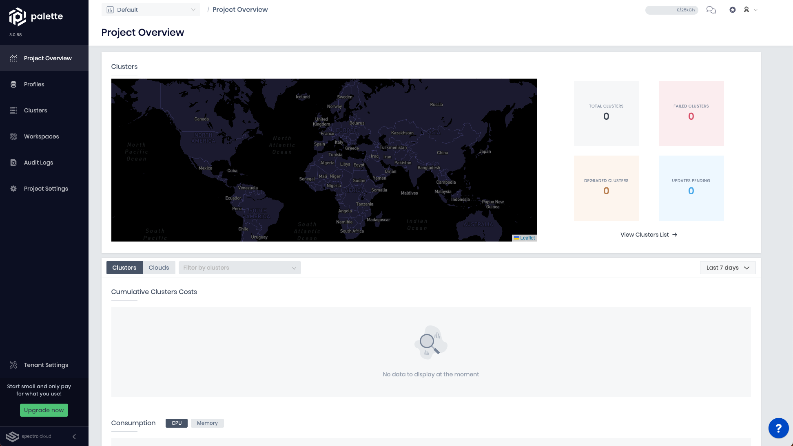

import Tabs from 'shared/components/ui/Tabs';
import WarningBox from 'shared/components/WarningBox';
import InfoBox from 'shared/components/InfoBox';
import PointsOfInterest from 'shared/components/common/PointOfInterest';
import Tooltip from "shared/components/ui/Tooltip";

# Palette Dashboards

This section is a tour of the two main dashboards of the Tenant console–the **Project Dashboard** and the **Admin Dashboard**. The Project Dashboard is used to perform operations related to setting up your Kubernetes clusters such as setting up Cluster Profiles, Creating Cloud Accounts, and deploying clusters. The Admin Dashboard is used for performing administrative tasks such as setting up Single Sign On (SSO), creating user, teams and setting up Role-Based Access Control (RBAC), and setting up additional package registries. The Admin Dashboard is only available to the users who have the Tenant Admin role. Admin users can toggle between the Project Dashboard and Tenant Admin Dashboard. Users without the Tenant Admin role can only see the Project Dashboard.

## Project Dashboard

Upon login, the dashboard shows the views available for a non-admin user. At the top, we have the <Tooltip trigger={<u>Projects</u>}> A <a href="/projects">Project</a> helps to organize the cluster resources in a logical grouping method.</Tooltip> button which helps to organize the cluster resources in a logical grouping. From the dropdown, we can shift between the projects. The left panel contains the <Tooltip trigger={<u>Project Overview</u>}><a href="/projects">Project Overview</a> gives an overview of the resource and cost consumption of the selected project.</Tooltip> (2) which gives an overview of the resource and cost consumption of the selected project. <Tooltip trigger={<u>Cluster Profiles</u>}><a href="/cluster-profiles">Cluster Profiles</a> are instantiated templates that are created with pre-configured layers/components needed for cluster deployments.</Tooltip> (3) of the Default Project are shown. The left pane in this dashboard also contains options for <Tooltip trigger={<u>clusters</u>}>Kubernetes <a href="/clusters">clusters</a> in Palette that are instantiated from cluster profiles.</Tooltip> (4). <Tooltip trigger={<u>Workspaces</u>}><a href="/workspace">Workspace</a> Workspace enables the coupling of relevant namespaces across multiple clusters to manage access, obtain cost, and workload visibility by applications or teams.</Tooltip> (5) enables the coupling of relevant namespaces across multiple clusters to manage access, obtain cost, and workload visibility by applications or teams. <Tooltip trigger={<u>Audit logs</u>}><a href="/audit-logs/">Audit Logs </a> gives the log of activities with timeline.</Tooltip> (6) gives the log of activities with timeline.

#### Non-admin User view

Upon login, the dashboard shows the views available for a non-admin user. 

1. The <Tooltip trigger={<u>Projects</u>}> A <a href="/projects">Project</a> helps to organize the cluster resources in a logical grouping method.</Tooltip> button which helps to organize the cluster resources in a logical grouping. From the dropdown, we can shift between the projects. 

2. The left panel contains the <Tooltip trigger={<u>Project Overview</u>}><a href="/projects">Project Overview</a> gives an overview of the resource and cost consumption of the selected project.</Tooltip> (2) which gives an overview of the resource and cost consumption of the selected project.
 

3. <Tooltip trigger={<u>Cluster Profiles</u>}><a href="/cluster-profiles">Cluster Profiles</a> are instantiated templates that are created with pre-configured layers/components needed for cluster deployments.</Tooltip> of the Default Project are shown. The left pane in this dashboard also contains options for <Tooltip trigger={<u>clusters</u>}>Kubernetes <a href="/clusters">clusters</a> in Palette that are instantiated from Cluster Profiles.</Tooltip> 

4. <Tooltip trigger={<u>Workspaces</u>}><a href="/workspace">Workspace</a> Workspace enables the coupling of relevant namespaces across multiple clusters to manage access, obtain cost, and workload visibility by applications or teams.</Tooltip> enables the coupling of relevant namespaces across multiple clusters to manage access, obtain cost, and workload visibility by applications or teams.

5. <Tooltip trigger={<u>Audit logs</u>}><a href="/audit-logs/">Audit Logs </a> shows the log of activities with timeline.</Tooltip> shows the log of activities with timeline. 

 

6. The **Settings** section (7) of the Default dashboard relates to the Cloud Account settings, Backup Location settings, and Alerts. This is an important distinction from the settings under the Admin Dashboard. It also allows the user to upload SSH keys for safekeeping. These key(s) can be recalled when deploying a cluster.

 

## Tenant Admin Dashboard

The menu within the Tenant Admin Dashboard contains the Projects button. This is different from the Projects menu in the Default Dashboard. Within the Tenant Admin Dashboard, the Projects button provides access to modifying a project itself (edit/configure/delete and the overall status), whereas the button in the Default Dashboard provides access to the Cluster Profiles inside the project.

1. The Cluster Profiles button in the Tenant Admin Dashboard provides the ability to create and manage Global Cluster profiles that can be used for cluster creation, across all projects, within a tenant.

2. The <Tooltip trigger={<u>Roles</u>}>A <a href="/user-management/rbac#roles">Role</a> is a collection of permissions.</Tooltip> (and <Tooltip trigger={<u>Permissions</u>}><a href="/user-management/rbac/#permissions">Permissions</a> are associated with specific actions within the platform.</Tooltip>); as well as <Tooltip trigger={<u>Users</u>}><a href="/user-management">Users</a> are members of a tenant who are assigned roles that control their access within the platform.</Tooltip> and <Tooltip trigger={<u>Teams</u>}>A <a href="/glossary-all/#team">Team</a> is a group of users.</Tooltip> Allows the admin to set or restrict these attributes for one or more team members. See the <Tooltip trigger={<u>RBAC</u>}>Palette's <a href="/user-management#rbac">RBAC</a> design allows granting granular access to resources and its operations.</Tooltip> section for more details.

3. The <Tooltip trigger={<u>audit logs(9)</u>}>The Palette management platform application captures <a href="/audit-logs">audit logs</a> to track the user interaction with the application resources along with the timeline.</Tooltip> in the admin Dashboard allow the admin to track the user interaction with the application resources along with the timeline for all projects and users. For admin users, the "audit log" button is visible for each project as well. Here, the admin can view the logs of the resources specific to the project.

4. Finally, the Tenant Admin settings (10) under the Admin Dashboard provide access to the <Tooltip trigger={<u>pack registries</u>}>A <a href="/registries-and-packs">pack</a> is a collection of files such as manifests, Helm charts, ansible roles, configuration files, etc.</Tooltip>; <Tooltip trigger={<u>private cloud gateways</u>}>A <a href="/glossary-all/#privatecloudgateway">Private Cloud Gateway</a> is a Palette component that enables the communication between Palette's management console and a VMware based private data center.</Tooltip> and [SAML SSO](/user-management/saml-sso) configurations.

 

