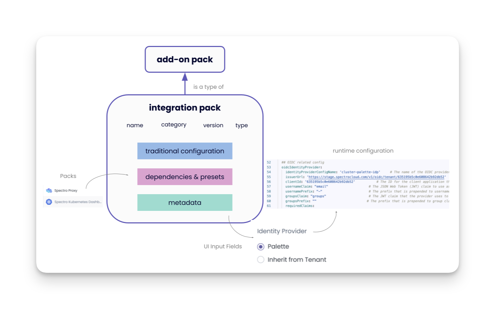

import {Content} from "shared/layouts/Default";
import Tabs from "shared/components/ui/Tabs";
import Packs from "shared/components/common/Integrations/Packs"
import AppTiers from "shared/components/common/Integrations/AppTiers"
import WarningBox from 'shared/components/WarningBox';
import InfoBox from 'shared/components/InfoBox';

# Overview

Palette provides many add-on packs that are stand-alone and do not have dependencies. For more complex configurations, Palette has introduced integrated packs. Integrated packs have dependencies that are handled internally, giving users convenience over configuration. Both types of packs are available when you create a cluster. 

Say you want to add the Kubernetes dashboard to your cluster profile. Typically, this would require manually adding a dependency proxy pack to enable the use of a reverse proxy with a Kubernetes cluster. It also requires configuring third-party authentication through OIDC.  

Palette’s integrated version of the Kubernetes dashboard pack, called Spectro Kubernetes Dashboard, handles dependencies internally and has pre-set defaults, so it does not require configuration. The diagram uses Spectro Kubernetes Dashboard to illustrate the concept of integrated packs. 

The diagram shows how Spectro Kubernetes Dashboard uses the traditional configuration and automatically includes its dependencies on the Spectro Proxy pack and the enabling of the Kubernetes Dashboard. Its metadata handles default settings in the user interface to select Palette as the Identity Provider (IDP).

Integrated packs offer the flexibility to change defaults if needed. However, changing the defaults in an integrated pack would require some configuration. 

 

<WarningBox>

We recommend using the pack defaults because default settings provide best practices for your clusters. Changing the default settings can introduce misconfigurations. Carefully review the changes you make to a pack.

</WarningBox>

 

 

